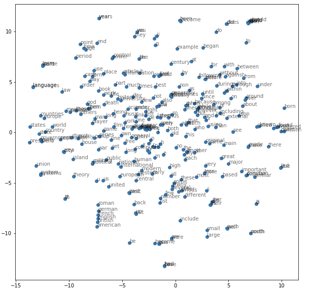

# CS_224N_NLP-Course

This repository contains homework and the final project of DeepPavlov Deep Learning for the NLP course.

## Homework 1
The purpose of this assignment was to get familiar with the PyTorch library. The first sub-part was to implement the flatten function of an input tensor. Meaning given an input tensor of shape N x C x H x W we want to return N x (C x H x W). The second sub-part was to implement a forward pass of the two-layer fully-connected ReLU network. And the third part was to explore different types of PyTorch Module API

## Homework 2
Assignment 2 involved the exploration of the Word2Vec model on our choice (CBOW in my case). After 10 epochs my Negative Log-Likelihood loss was around 6706. Below is a visualization of 300 words vector representations

  

## Homework 3
The task was composed of two parts. In part one, it was needed to code a character-based language model with recurrent (GRU) neural network architecture. And part two consisted of an exploration of different model architectures for text classification task (models used: bidirectional LSTM, bidirectional two-layer LSTM, few Convolutional neural networks)

## Project

### Multilingual-BERT for text classification
__1. Data__ 
For my experiments I have taken 2 datasets: [RuTweetCorp](https://study.mokoron.com/) and [Kaggle: Twitter Sentiment Analysis](https://www.kaggle.com/c/twitter-sentiment-analysis2/data). Russian dataset consists of 114 911 positive and 111 923 negative tweets. English dataset consists of 56 457 positive and 43 532 negative tweets.

__2. Experiment setup__
The purpose of these experiments was to explore whether the multilingual-BERT model can transfer knowledge from one language to another on a classification task. So, the first step of fine-tuning was done on the English dataset (99 989 samples), following with fine-tuning on the train split of Russian data (181 467 samples). Below you can see the table of classification metrics on test split (22 684 samples).

Model | Accuracy | Precision | Recall | F1
------|----------|-----------|--------|-------
Raw M-BERT | 49.5% | 49.5% | 99.9% | 66.2%
MBERT-Ru | 99.9% | 99.9% | 99.9%| 99.9 % 
MBERT-En | 75.7% | 73.4% | 79.8% | 76.5%
MBERT-En-Ru | 99.9% | 100% | 99.9% | 99.9%
Raw RuBERT | 50.0% | 70.8% | 1% | 3% 
RuBERT | 99.9% | 100% | 99.8% | 99.9%
	
	
### Multilingual-BERT for Boolean Questions
Another task that we have tried to explore was Bool Question Answering. The obvious solution was to formulate this task as a binary classification. 

__1. Data__
Laking Russian BoolQ training data we have taken data that relates to a similar task - Natural Language Inference [[Data source]](https://github.com/facebookresearch/XNLI). As NLI has 3 target classes - 'contradiction', 'neutral', 'entailment' we have tried different types of mapping for binary classification. The first approach was to map 'contradiction' and 'neutral' to 0 and 'entailment' to 1. The second approach was to remove 'neutral' samples from the dataset. 

__2. Experiment setup__
We have tried to train and evaluate two models:  
	- Fine-tune the RuBERT model on the Russian NLI dataset and evaluate it on Russian Bool Questions  
	- Fine-tune Multilingual-BERT on English Bool Questions and evaluate the trained model on Russian Bool Questions
Results of the experiments are presented in a table below

 Model | Accuracy | Precision | Recall | F1
 ------|----------|-----------|--------|---------- 
 RuBERT-NLI_Ru | 39.2% | 32.6% | 84.9% | 47.1%
 MBERT-BoolQ_En | 31.9% | 31.9% | 1.0% | 48.3%  
